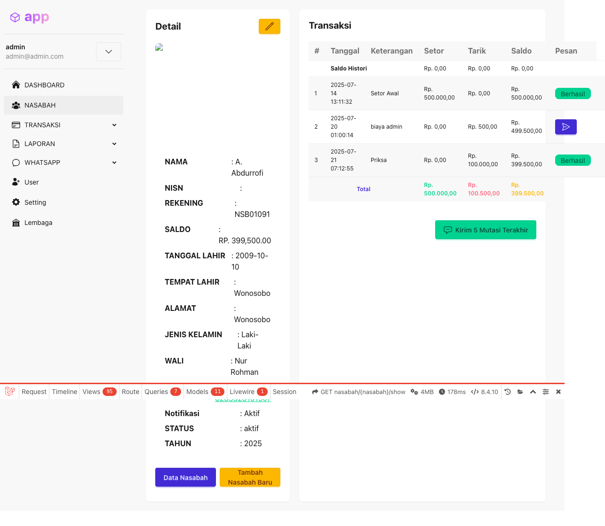
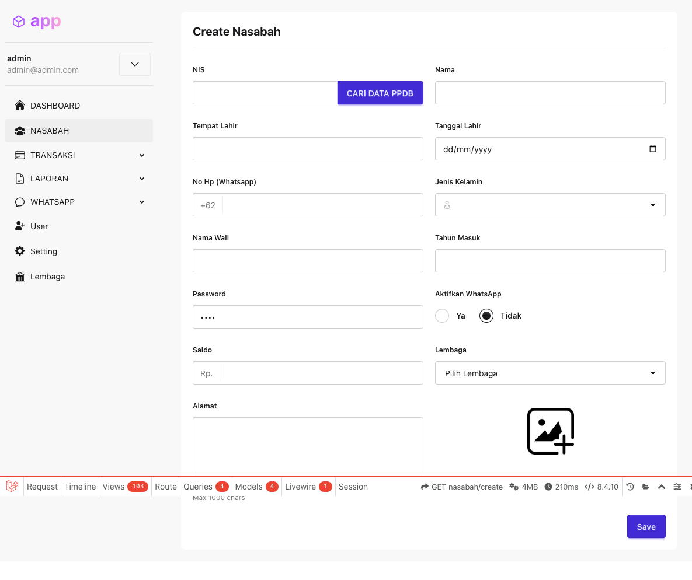
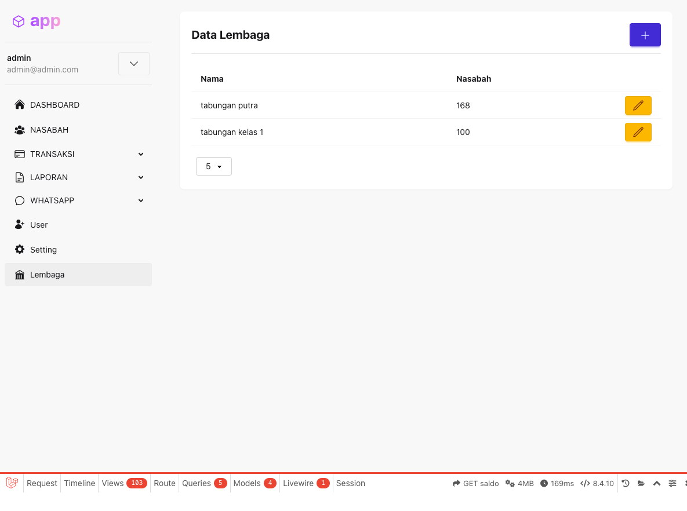

## 4a. Halaman Tarik Tunai
Digunakan untuk melakukan penarikan tabungan dari rekening nasabah. Langkah-langkahnya sama persis dengan setor tunai:

1. Buka menu **TRANSAKSI > Tarik Tunai**.
2. Masukkan **No Rekening** nasabah, tekan **Enter**.
3. Akan muncul modal **Konfirmasi Password**.
4. Masukkan password transaksi, klik **Cek**.
5. Isi nominal penarikan dan keterangan jika perlu.
6. Klik **Tarik** untuk menyimpan transaksi.

Contoh tampilan proses tarik tunai:

1. Halaman awal tarik tunai:
	
2. Modal konfirmasi password:
	
3. Form nominal dan keterangan:
	
4. Setelah klik Tarik dan transaksi berhasil:
	

> **Catatan:**
> Urutan dan tampilan sama seperti setor tunai, hanya label tombol dan judul halaman yang berbeda.
## 9. Detail Nasabah
Halaman detail nasabah menampilkan informasi lengkap satu nasabah, seperti:
- Nama, NISN, Rekening, Saldo, Tanggal & Tempat Lahir
- Alamat, Jenis Kelamin, Nama Wali, Telepon (dengan link WhatsApp)
- Status notifikasi, status aktif, tahun masuk

Di bagian bawah juga terdapat tabel histori transaksi (setor, tarik, biaya admin) beserta saldo akhir dan status transaksi.

Contoh tampilan halaman detail nasabah:

## 8. Tambah Nasabah
Halaman tambah nasabah digunakan untuk menambahkan data nasabah baru ke sistem. Berikut langkah-langkahnya:

1. Klik menu **NASABAH** lalu tombol **tambah data**.
2. Isi data nasabah pada form yang tersedia:
	- NIS (bisa cari data PPDB jika terintegrasi)
	- Nama, Tempat Lahir, Tanggal Lahir
	- No HP (Whatsapp), Jenis Kelamin, Nama Wali, Tahun Masuk
	- Password awal, status WhatsApp aktif/tidak
	- Saldo awal, pilih Lembaga, dan Alamat
3. Setelah semua data diisi, klik tombol **Save** untuk menyimpan.

Contoh tampilan form tambah nasabah:

# Dokumentasi Penggunaan Fitur Aplikasi Tabungan

Berikut adalah panduan penggunaan seluruh fitur utama pada aplikasi Tabungan.

## 1. Login
- Buka aplikasi di http://tabungan.test
- Masukkan email dan password Anda, lalu klik tombol **Login**.

## 2. Dashboard
Setelah login, Anda akan diarahkan ke halaman Dashboard.
Halaman ini menampilkan ringkasan jumlah nasabah, total saldo tabungan, saldo aktif, saldo non-aktif, dan grafik transaksi nasabah.

## 3. Menu Navigasi
- **NASABAH**: Melihat, menambah, mengedit, dan menghapus data nasabah.
- **TRANSAKSI**: Melakukan setor dan tarik tabungan nasabah.
- **LAPORAN**: Melihat dan mengekspor laporan transaksi, mutasi, harian, umum, dan riwayat.
- **WHATSAPP**: Mengirim pesan WhatsApp ke nasabah (jika tersedia).
- **USER**: Manajemen user aplikasi.
- **SETTING**: Pengaturan aplikasi, termasuk saldo awal dan konfigurasi lainnya.
- **LEMBAGA**: Informasi dan pengaturan lembaga.

## 3. Halaman Nasabah
Menu ini menampilkan daftar seluruh nasabah beserta detail rekening, nama, alamat, saldo, dan status. Anda dapat menambah, mengedit, menghapus, serta mengekspor data nasabah.

## 4. Halaman Setor Tunai

Digunakan untuk melakukan setor tabungan ke rekening nasabah. Berikut tampilan awal sebelum input nomor rekening:

Setelah itu, masukkan nomor rekening, nominal, dan simpan transaksi.

### Langkah-langkah Setor Tunai
1. Buka menu **TRANSAKSI > Setor Tunai**.
2. Masukkan **No Rekening** nasabah, lalu tekan **Enter** pada keyboard.
3. Akan muncul modal **Konfirmasi Password** yang menampilkan data nasabah (nama, rekening, dsb).
	
4. Masukkan password transaksi (misal: `1234`) pada kolom password, lalu klik tombol **Cek**.
5. Setelah password benar, akan tampil form setor tunai (isi nominal dan keterangan).
	
6. Masukkan **nominal** (misal: 100000) dan **keterangan** (misal: Setoran Agustus) pada form yang tersedia.
	
7. Klik **Setor** untuk menyimpan transaksi setor tunai.
	
8. Jika transaksi berhasil, akan muncul notifikasi "Berhasil Setor Tunai" dan data akan bertambah di tabel histori transaksi di sebelah kanan.

#### Penjelasan Tabel Histori Transaksi (kanan)
Tabel di sisi kanan halaman setor tunai menampilkan riwayat transaksi rekening yang sedang diproses. Kolom yang tersedia antara lain:
- **#**: Nomor urut histori
- **Tanggal**: Waktu transaksi
- **Keterangan**: Deskripsi transaksi (setor, tarik, biaya admin, dll)
- **Setor**: Jumlah uang yang disetor
- **Tarik**: Jumlah uang yang ditarik
- **Saldo**: Saldo tabungan setelah transaksi

Baris paling atas adalah saldo histori awal, diikuti daftar transaksi terbaru hingga terlama. Total setor, tarik, dan saldo akhir juga ditampilkan di bagian bawah tabel.

## 5. Halaman Laporan Transaksi
Menampilkan laporan transaksi tabungan berdasarkan filter tanggal dan lembaga. Data dapat diekspor ke Excel.

## 7. Fitur WhatsApp
- Pilih menu **WHATSAPP**.
- Pilih nasabah/daftar penerima.
- Tulis pesan dan kirim.

## 6. Halaman Setting
Digunakan untuk mengatur lembaga, tanggal pemotongan biaya admin, nominal biaya admin bulanan, saldo minimal, dan pengaturan notifikasi WhatsApp saldo habis.

## 9. Manajemen User
- Pilih menu **USER**.
- Tambah, edit, atau hapus user aplikasi.

## 7. Halaman Lembaga
Menampilkan daftar lembaga beserta jumlah nasabah di setiap lembaga. Tersedia aksi untuk mengelola data lembaga jika diaktifkan.

---

Jika ada fitur baru atau perubahan, silakan update dokumentasi ini sesuai kebutuhan.
